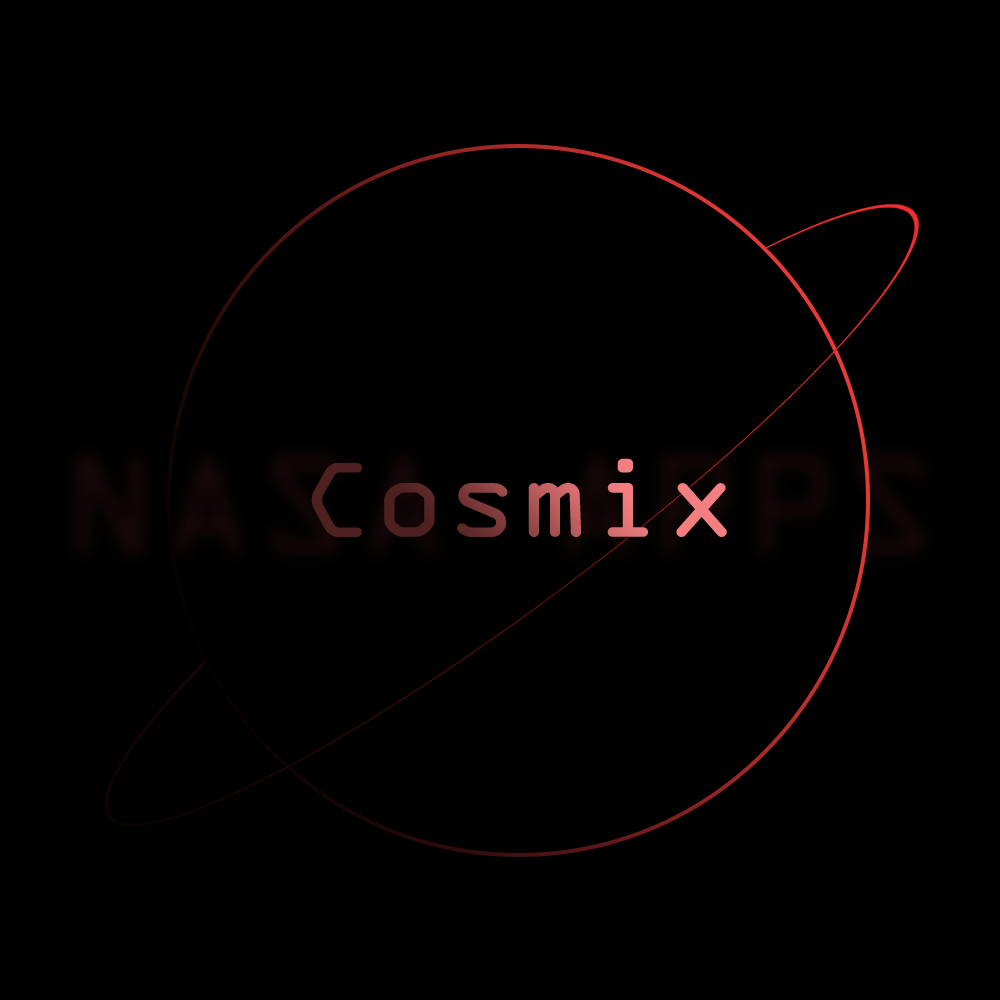
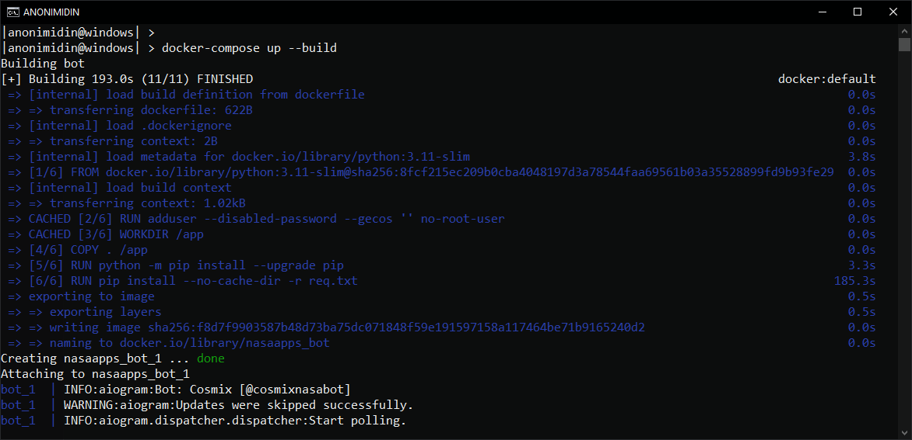

# COSMIX - Solar System Information Bot


COSMIX is a Telegram bot that provides information about the Solar System, space news, facts, and more. It's a fun and educational bot created by [S0M0NI_BL00D_0VERFLAW]([https://t.me/anonimidin](https://www.spaceappschallenge.org/2023/find-a-team/s0m0ni_bl00d_0verfl0w/)) with a passion for space exploration in only 2 days...

## Table of Contents

- [Features](#features)
- [Prerequisites](#prerequisites)
- [Installation](#installation)
- [Usage](#usage)
- [Contributing](#contributing)

## Features

- Get information about the planets in our Solar System.
- Receive the latest space news from NASA.
- Explore interesting space facts.
- View the Astronomy Picture of the Day (APOD).
- Get updates on Mars weather (currently disabled).
- Learn about near-Earth asteroids.
- Track the International Space Station (ISS) location and its crew.

## Prerequisites

Before you can run COSMIX, you'll need the following:

- Python 3
- Telegram Bot API Token (BOT_API_TOKEN)
- NASA API Key (NASA_API_KEY)
- Docker (optional)

## Installation

1. Clone the repository:

   ```bash
   git clone https://github.com/yourusername/cosmix-telegram-bot.git
   cd cosmix-telegram-bot
   
2. Create a virtual environment (optional but recommended):

    ```bash
   python -m venv venv
   source venv/bin/activate  # On Windows, use `venv\Scripts\activate`

4. Install the required Python packages:

   ```bash
   pip install -r req.txt

5. Add API token to .env file based on your interpreter:
- Bash (Linux)

   ```bash
   read -p "Enter your BOT_API_TOKEN: " bot_token && read -p "Enter your NASA_API_KEY: " nasa_token && sed -i "s/BOT_API_TOKEN=.*/BOT_API_TOKEN=$bot_token/; s/NASA_API_KEY=.*/NASA_API_KEY=$nasa_token/" .env
   
- CMD (Windows)

  ```bash
  @echo off
  set /p BOT_API_TOKEN=Enter your BOT_API_TOKEN: 
  set /p NASA_API_KEY=Enter your NASA_API_KEY: 
  powershell -Command "(Get-Content .env) -replace '^BOT_API_TOKEN=.*', 'BOT_API_TOKEN=%BOT_API_TOKEN%' -replace '^NASA_API_KEY=.*', 'NASA_API_KEY=%NASA_API_KEY%' | Set-Content .env"

- PowerShell (Windows & Linux)

  ```bash
  $bot_token = Read-Host "Enter your BOT_API_TOKEN"
  $nasa_token = Read-Host "Enter your NASA_API_KEY"
  (Get-Content .env) -replace "^BOT_API_TOKEN=.*", "BOT_API_TOKEN=$bot_token" -replace "^NASA_API_KEY=.*", "NASA_API_KEY=$nasa_token" | Set-Content .env

6. Run the bot

   ```python
   python3 cosmix.py

- Via docker compose

  ```bash
  docker-compose up --build

### Result
  
  <hr>
## Usage
- Start a chat with your bot on Telegram.
- Use the provided commands or buttons to interact with COSMIX.
- Explore the features and have fun learning about space!

## Contributing
If you encounter bugs or have suggestions for improvements OR have code with fixed bugs, please feel free to open an issue or submit a pull request. Contributions are welcome!
